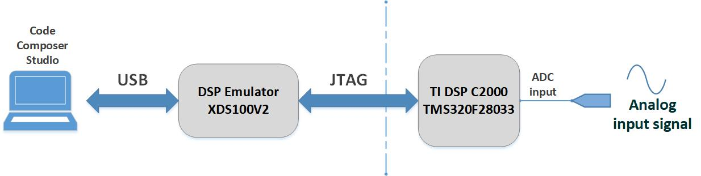
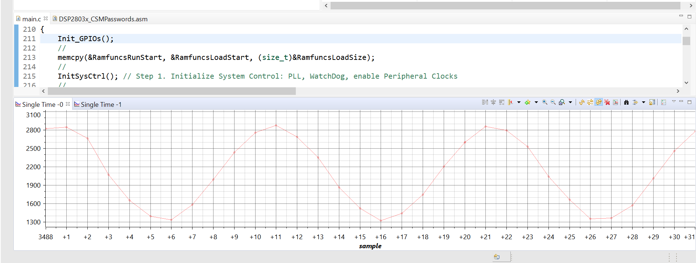
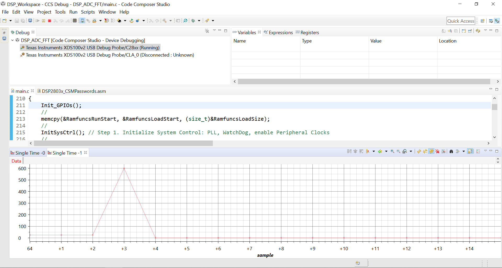
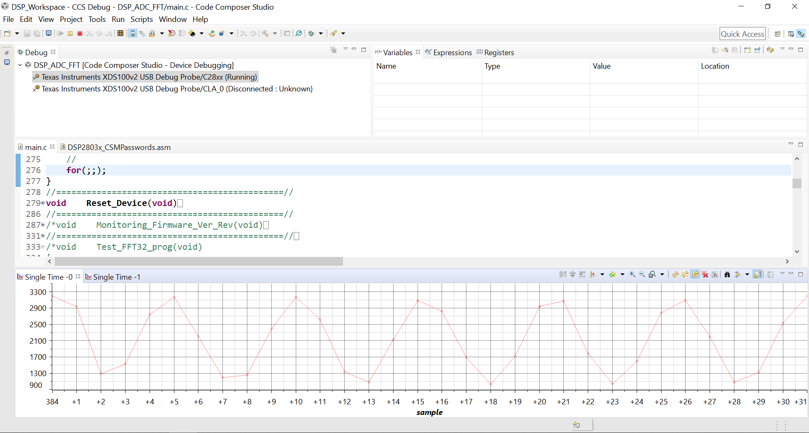
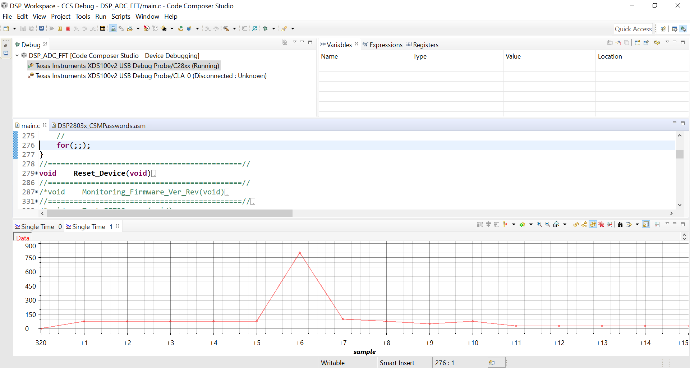
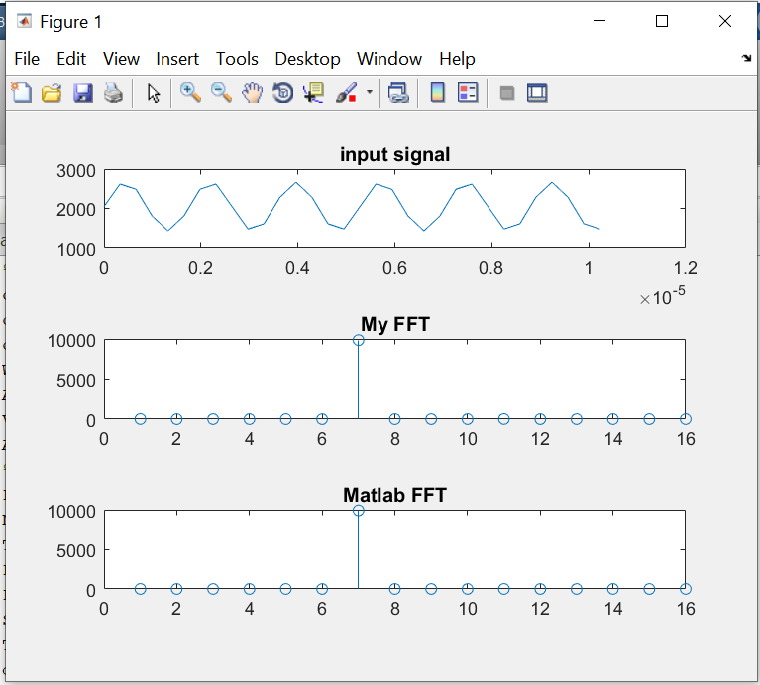

# 
A sample/template project with Texas Instruments DSP TMS320F28033 (C2000 piccolo series). This project focuses mainly on ADC (Analog-to-Digital Conversion) and FFT (Fast Fourier Transform) processing over sampled data. The sampled data and FFT processed data can be monitored using JTAG Debugger (XDS100v2) and Code Composer Studio (official IDE provided by TI) software. The DSP chip clock frequency is 60MHz (12MHz input clock multiplied by 5 by internal PLL). Sampling rate of ADC in this project is 3MSPS (Mega sample per second) which has been implemented in an innovative approach to achieve the most available speed. The ADC function is associated by on-chip PWM double signals which trigger two SoC (start of conversion) to force the ADC running parallel and simultaneously. In every sampling window 32 successive samples are sampled and buffered that lasts about 10us (330ns sampling-time * 32). A timer which interrupts every 1ms is used to start a sampling window. The sampled data, then, are applied to FFT process. The size of FFT is 32-point and has been implemented based on radix-2 model and without using any library. The processing time of implemented FFT is about 130us. Also, the FFT function has been modeled and simulated by MATLAB. 

Overall Block Diagram:

#
screenshots of Code Composer Studio debugging utility are shown as follows:

A sampled analog signal with the frequency of 300KHz and the FFT output:

A sampled analog signal with the frequency of 600KHz and the FFT output:

#
Matlab simulation results and a comparison between the FFT function of Matlab versus the simulated radix-2 FFT model:

